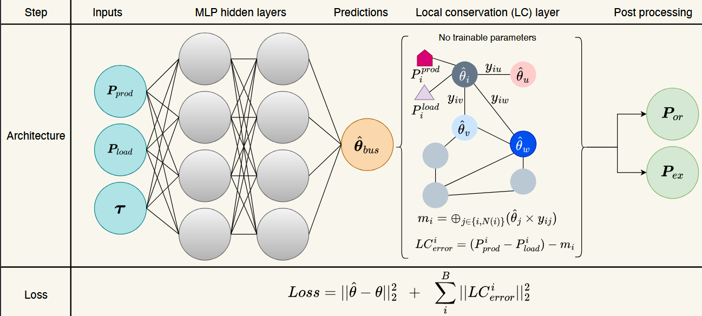
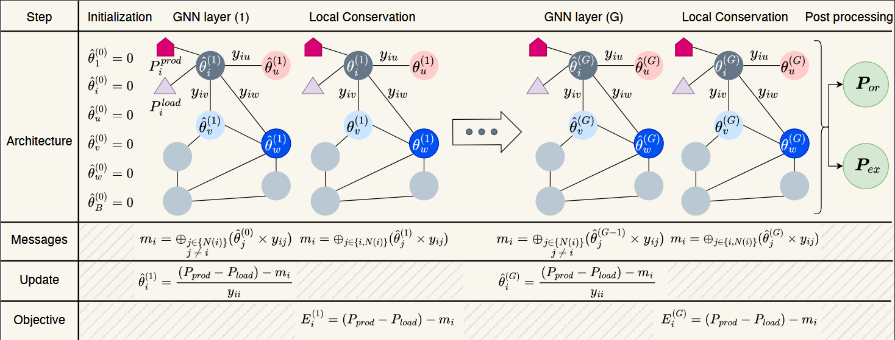

# GNN Powergrid
This repository implements Physics Informed Neural Networks for Power Flow simulation.

An MLP with physics loss (local conservation error) as pendalization or regularization. 
<div align="center">
  
</div>

A graph-based approach to optimize the local conservation law. 
<div align="center">
  
</div>

To read more about the different approaches, the reader is referred to the paper (available soon).

<!-- 
 -->
## Getting started

See the getting started notebooks at the root of this repository for the examples on how to use this package

## Installation
To be able to run the experiments in this repository, the following steps show how to install this package and its dependencies from source.

### Requirements
- Python >= 3.10

### Setup a Virtualenv (optional)
#### Create a Conda env (recommended)
```commandline
conda create -n venv python=3.10
conda activate venv
```
#### Create a virtual environment

```commandline
cd my-project-folder
pip3 install -U virtualenv
python3 -m virtualenv venv
```
#### Enter virtual environment
```commandline
source venv_gnn/bin/activate
```

### Install from source
```commandline
git clone https://git.irt-systemx.fr/milad.leyli-abadi/GNN-powergrid.git
cd pinns-powergrid
pip3 install -r requirements.txt
cd ..
```

## Using the scripts
Data generation
- `env_name`: The environment name to be selected. `l2rpn_case14_sandbox` or `l2rpn_neurips_2020_tack1_small`
- `n_training_data`: Number of training data to be generated
- `n_validation_data`: Number of validation data to be generated
- `n_test_data`: Number of test data to be generated
- `n_ood_data`: Number of test data to be generated

Different arguments could be used for each script, which are details below:
- `train`: A boolean to indicate whether the model should be trained
- `epochs`: the number of epochs the model should be trained
- `n_train`: The number of tranining that should done (the final results are reported using mean +/- std)
- `env_name`: The environment name to be selected. `l2rpn_case14_sandbox` or `l2rpn_neurips_2020_tack1_small`
- `save_path`: the path where the model should be saved
- `load_path`: the path where the model is saved. It can be used whether for retraining or only evaluation
- `model_name`: the name of the model that is used during the save operation.
- `batch_size`: the batch size used when creating the data loaders
- `train_continue`: Whether to continue the training from a pretrained model
- `train_num`: the identifier of the trained model that should be continued

MLP specific arguments:
- `hidden_layers`: a tuple of numbers indicating the number of layers and neurones in each layer

GNN specific arguments:
- `num_gnn_layers`: number of message passing layers used for optimization of physical constraint
- `ref_node`: the reference node id in each environment
  - should be set to `0` for `l2rpn_case14_sandbox`
  - should be set to `35` for `l2rpn_neurips_2020_tack1_small`

### Generate data
The provided datasets in the repository are for the purpose of illustration and demo. For the proper training of the models, you should generate some more datasets using the following command.
```bash
python generate_data.py --env_name="l2rpn_case14_sandbox" --n_training_data=10000 --n_validation_data=10000 --n_test_data=10000 --n_ood_data=10000
```

### Train a model
Train an MLP model
```bash
python 01_MLP_regularized.py --train True --epochs=200 --n_train=1 --env_name="l2rpn_case14_sandbox" --save_path="trained_model/MLP_REG_14" --hidden_layers="(800, 800, 500, 300, 300)"
```
Train a Graph model
```bash
python 03_GNN_init_FC.py --train True --n_train=1 --epochs=100 --num_gnn_layers=60 --env_name="l2rpn_case14_sandbox" --ref_node=0 --save_path="trained_model/GNN_init_FC_14"
```
Change the environment
```bash
python 03_GNN_init_FC.py --train True --n_train=1 --epochs=100 --num_gnn_layers=80 --env_name="l2rpn_neurips_2020_track1_small" --ref_node=35 --save_path="trained_model/GNN_init_FC_36"
```

### Evaluate a trained model
Evaluate a MLP based method
```bash
python -i 01_MLP_regularized.py --load_path="trained_model/MLP_REG_14" --model_name="model_epoch_200.pt" --n_train=1 --env_name="l2rpn_case14_sandbox" --save_path="trained_model/MLP_REG_14" --hidden_layers="(800, 800, 500, 300, 300)"
```

Evaluate a GNN based method
```bash
python -i 03_GNN_init_FC.py --n_train=1 --train_num=0 --num_gnn_layers=60 --env_name="l2rpn_case14_sandbox" --ref_node=0 --load_path="trained_model/GNN_init_FC_14" --model_name="model_epoch_100.pt" --save_path="trained_model/GNN_init_FC_14"
```

### Benchmark a model using multiple training
```bash
python -i 01_MLP_regularized.py --train True --epochs=200 --n_train=3 --env_name="l2rpn_case14_sandbox" --save_path="trained_model/MLP_REG_14" --hidden_layers="(800, 800, 500, 300, 300)"
```

